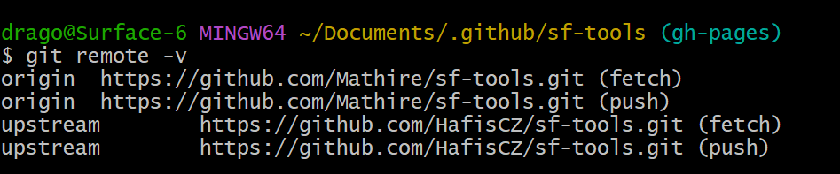
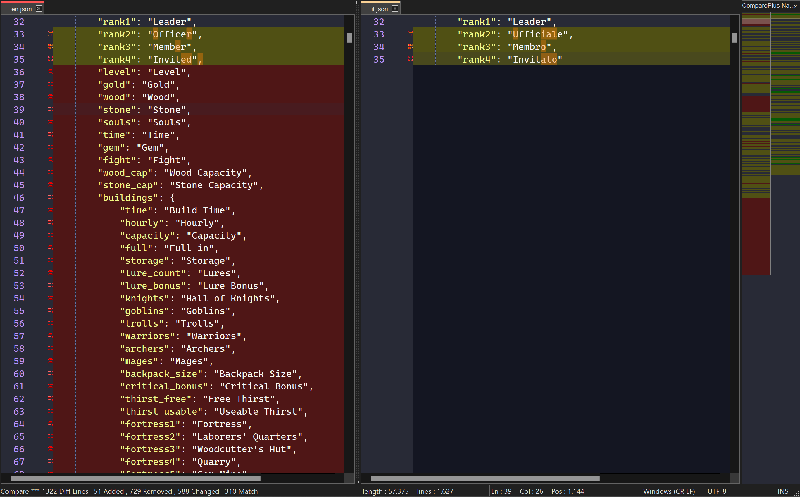
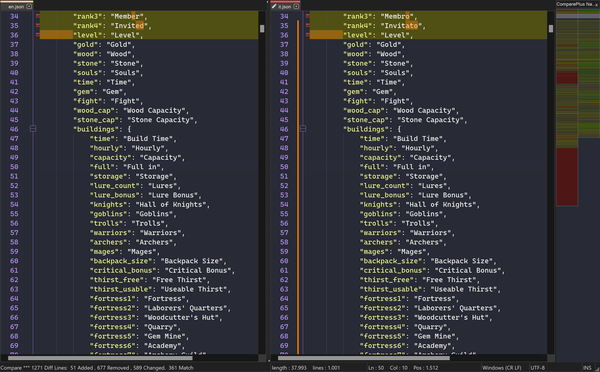
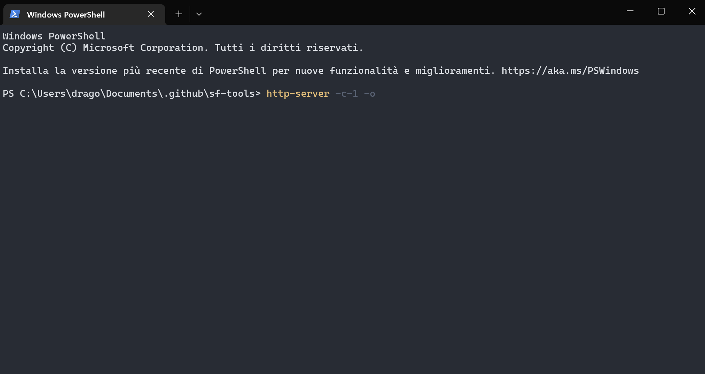

# Translating sftools

## Requirements

- Notepad ++;
- Node.js (to run http-server);
- Git;

## First steps

1. Clone your fork locally;
2. Use `git remote add origin <url>`;
3. Use `git remote add upstream https://github.com/HafisCZ/sf-tools.git` to add mar21 repo as upstream;
4. Use `git remote -v` to check if everything is working;

## Translating

Open Notepad ++ and install the plugin "Compare plus" in the "plugin" section. 

Note: after install, I recommend to go to "plugin->compare plus" and check-off "auto re-compare on change".

Now you can start translating. Go to your sf-tools directory, and open:

- en.json;
- <your language>.json.

Select <your language>.json in notepad ++ and under "plugin->compare plus" click on "set as first to compare". 
Now select en.json and under "plugin->compare plus" click on "compare".

It will look like this:

Now you can start translating by copying the parts that are missing and changing the translation:

Once you finished, it's time to test it. Save your files, close notepad ++ and go to sf-tools directory.

Open terminal there and use `http-server -c-1 -o` to start a local server (-c-1 sets cache to 0 and -o open favourite browser).
Sftools site should load, now you can check your translations (ctrl + c in your terminal will stop local server).

Note: if the site is broken, you probably missed / added some commas in <your lang>.json .

If everything works, you can commit changes.

## Commit and pr

In your sftools directory, open git bash and type:

- `git add .`;
- `git commit -m "commmit message"`;
- `git push origin`;

Now on your github page you should have your new commits. Make a PR from there. 
